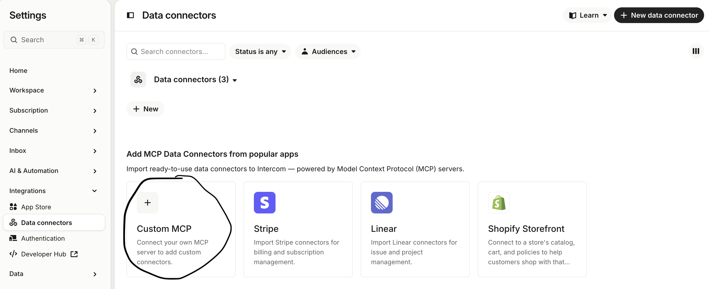
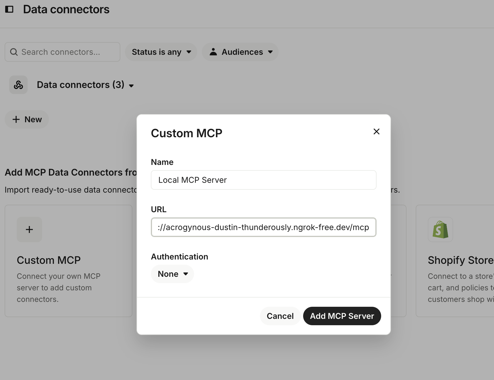
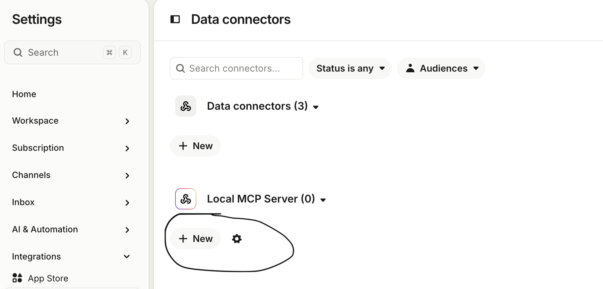
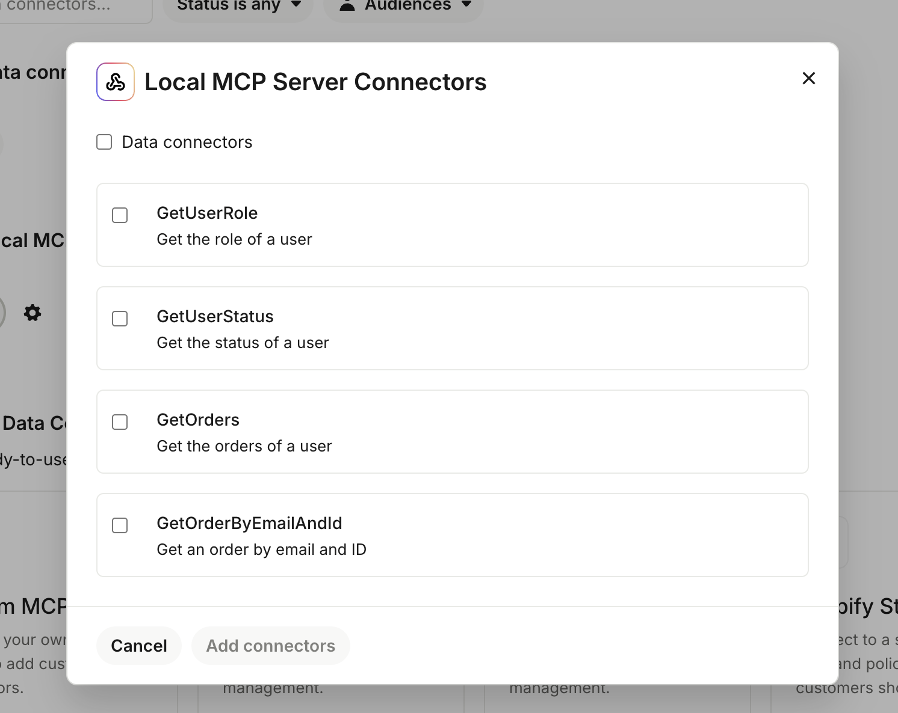

# MCP Node Server

A Model Context Protocol (MCP) server built with Node.js, Express, and TypeScript.

## Prerequisites

- Node.js (v18 or higher)
- npm (comes with Node.js)

## Installation

1. Install dependencies:
```bash
npm install
```

## Running the Server

Start the server:

```bash
npx -y tsx main.ts
```


The server will start on `http://localhost:3000/mcp` by default. You can change the port by setting the `PORT` environment variable:

```bash
PORT=8080 npx tsx main.ts
```

## API Endpoint

- **POST** `/mcp` - MCP server endpoint


## Connect to Intercom

Easiest way to connect to Intercom locally is to use [ngrok](https://ngrok.com/docs/what-is-ngrok) to tunnel the MCP server to the internet.

1. Go to https://app.intercom.com/a/apps/${app_id}$/settings/app-settings/custom-actions
2. Click on "Custom MCP"

3. Enter the MCP server URL: `https://<ngrok-url>/mcp` 

4. Click on "Add MCP Server"

5. Once the Custom MCP is added, go to the Data Connector and click "New". It will show you a list of tools that can be integrated with Intercom.


